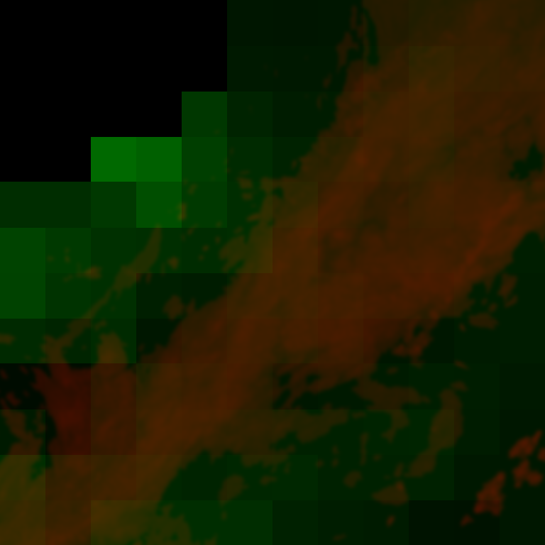
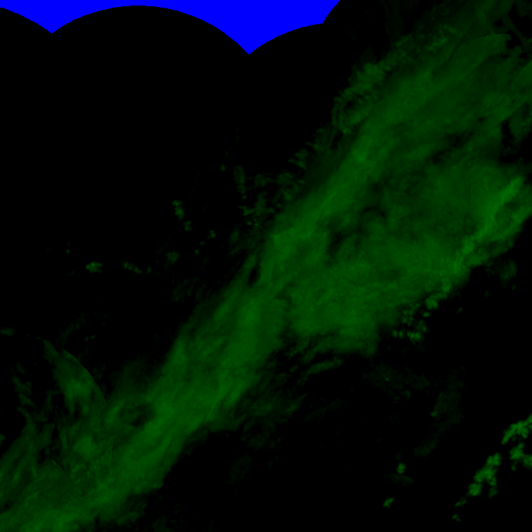
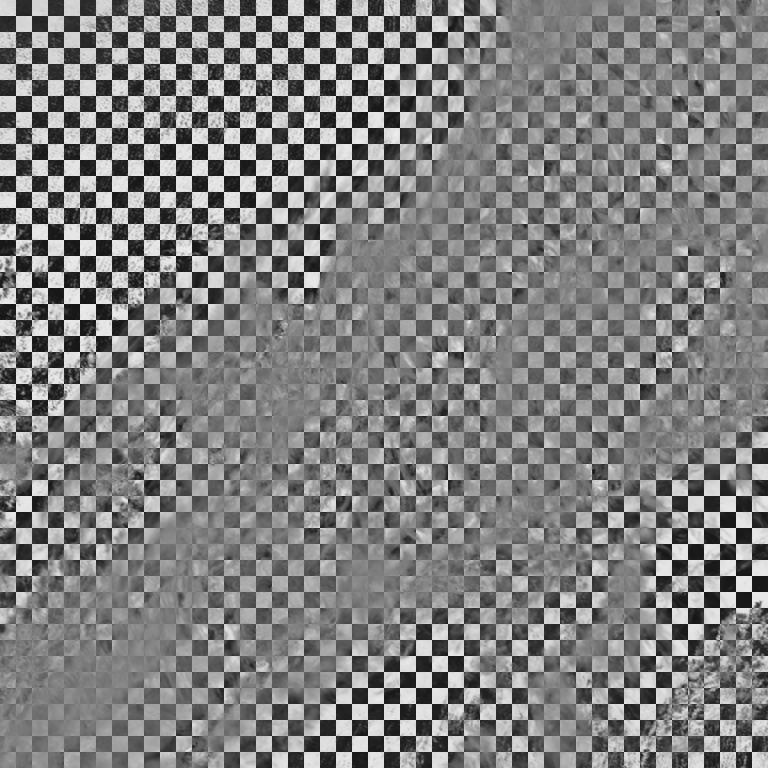

# tile2png


## usage

### Radar
Rainviewer
```python
uv run command.py radar rainviewer --lat_bounds 37.742 41.875 --lon_bounds 113.782 119.161 --output radar_rainviewer.png
```

Windy
```python
uv run command.py radar windy --lat_bounds 37.742 41.875 --lon_bounds 113.782 119.161 --output radar_windy.png
```


### Satellite

```python
# vis
uv run command.py sate windy --type vis --lat_bounds 37.742 41.875 --lon_bounds 113.782 119.161--output windy_sate-vis.png

uv run command.py sate windy --type infra --lat_bounds 37.742 41.875 --lon_bounds 113.782 119.161 --output windy_sate-infra.png
```


## Todo

- [ ] function
    - [ ] output projection
    - [ ] reverse value
- [ ] other map tiles support
    - [ ] windy
    - [ ] google map